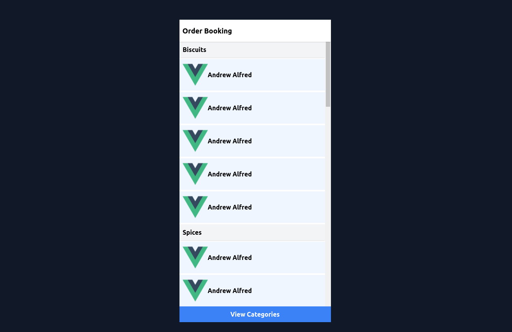

# Order Taking UI concept

Sample demonstrating UI demo for a order taking screen

- Sticky headers for categories
- Bottom button to select a cateogy from all categories dialog

## 👍 Contribution

1. Clone it
2. Create your feature branch (git checkout -b my-new-feature)
3. Commit your changes (git commit -m 'Add some feature')
4. Push to the branch (git push origin my-new-feature)
5. Create new Pull Request

## ✨ Active Contributors

<table>
<tr>
    <td align="center" style="word-wrap: break-word; width: 150.0; height: 150.0">
        <a href=https://github.com/apgapg>
            
             
            <b>Ayush P Gupta</b>
        </a>
    </td>
</tr>
</table>
